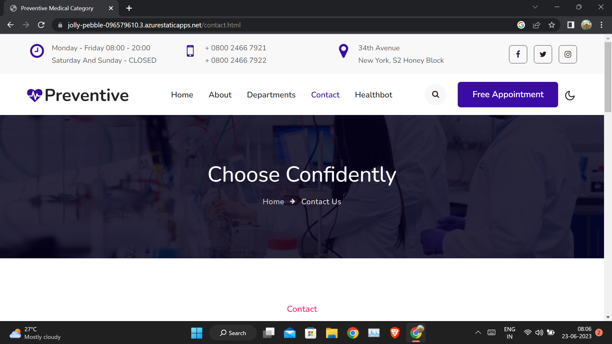
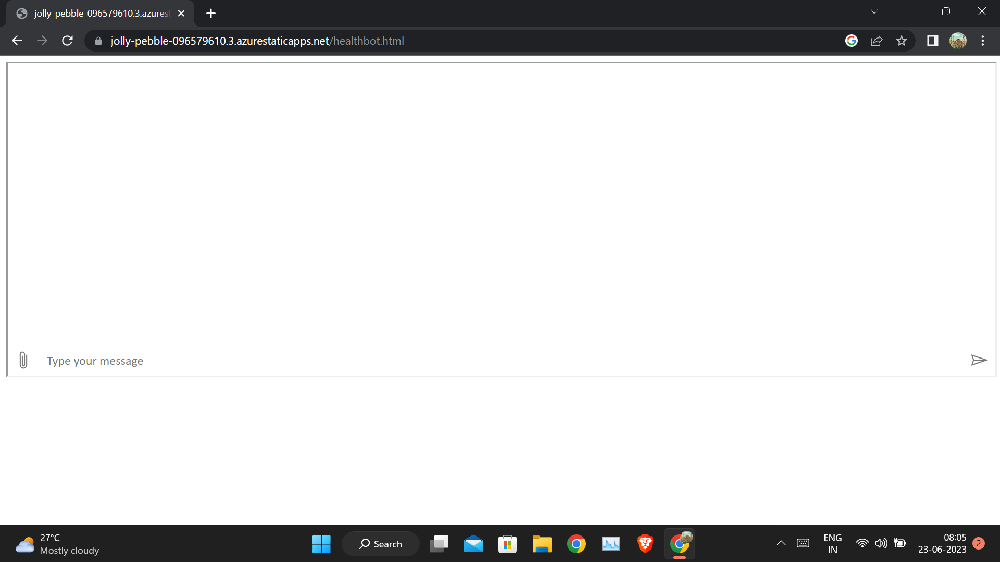

# ⚡ Preventive⚡

This is a web based application developed for health related telugu based website in India.

### This web based application has been developed for the applications of Future Ready Talent Internship program launched by Microsoft, Future Skills Prime,Quess ,Github and Ey.

** Project Link**-https://jolly-pebble-096579610.3.azurestaticapps.net

** Project demo video link**-

## Azure technologies used for Project 
- Static web apps
- Health bot
 
## Features and Functionalities 😃
- Interactive and responsive UI.
- Has many graphical and visual innovative effects.
- Have an aesthetically pleasing visual design and architecture.
- Has collection of many web pages including Home, About Us , Contact,Menu, health topics and health related information etc.
- User can know about health information through this webiste.
- Included the feedback Survey form to increase the scope of improvement.

## Screenshots

### About us-

### Contact us-
 
 
 

### Health bot

## Tech stack💻
- Azure(hosting)
- HTML
- CSS
- Bootstrap
- JavaScript
